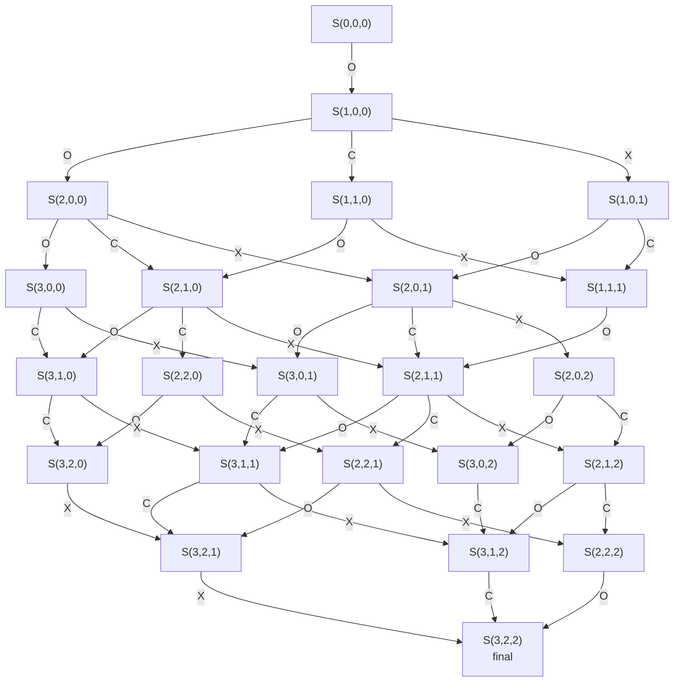

# Mn3O4 One-Layer Growth DFT Diagram

## Notation

한 층의 `Mn3O4`가 성장하기 위해 필요한 elementary event를 다음처럼 둔다.

- `O`: olation, `+ Mn(OH)2` adsorption
- `C`: condensation, `- H2O`, adsorbed `Mn(OH)2`와 bridge 형성
- `X`: oxidation, `+ 1/4 O2 - 1/2 H2O`

상태는 아래처럼 표기한다.

```text
S(o,c,x)
```

- `o`: olation 횟수, `0 <= o <= 3`
- `c`: condensation 횟수, `0 <= c <= 2`
- `x`: oxidation 횟수, `0 <= x <= 2`

최종적으로 한 층이 완성된 상태는 다음과 같다.

```text
S(3,2,2)
```

## Allowed Transitions

DFT 계산용 상태 그래프는 아래 규칙으로 만들 수 있다.

```text
O: S(o,c,x) -> S(o+1,c,x)    if o < 3
C: S(o,c,x) -> S(o,c+1,x)    if c < 2 and c < o
X: S(o,c,x) -> S(o,c,x+1)    if x < 2
```

여기서 `c < o` 조건은 condensation이 적어도 하나의 olated `Mn(OH)2`가 존재한 뒤에만 가능하다는 의미이다.  
oxidation은 첫 반응으로도 올 수 있다고 두었기 때문에 `o`와 독립적으로 허용한다.

## Number of Cases

단순하게 첫 반응은 `O/X` 2가지, 이후 6번 반응은 `O/C/X` 3가지라고 보면 전체 brute-force 상한은 아래와 같다.

```text
2 * 3^6 = 1458
```

하지만 한 층 성장의 stoichiometry가 `O3 C2 X2`로 고정되어 있으므로 실제 sequence 후보는 더 작다.

```text
7! / (3! 2! 2!) = 210
```

여기서 condensation이 olation보다 먼저 누적될 수 없다는 prefix 조건, 즉 모든 중간 단계에서 `c <= o`를 적용하면 실제 허용 sequence는 아래와 같다.

```text
105
```

따라서 자동 생성 agent에서는 `1458`개를 모두 만들 필요 없이, 먼저 `O3 C2 X2` 조성 필터를 걸고 그다음 `c <= o` 조건을 적용하면 된다.

상태 그래프 기준으로는 고유 중간체 상태가 `27`개, 고유 elementary transition edge가 `51`개이다.

## Representative Pathway

논문/발표용으로는 아래처럼 대표 pathway를 먼저 보여줄 수 있다.

```mermaid
flowchart LR
    S000["S(0,0,0)<br/>clean surface"]
    S100["S(1,0,0)<br/>O1"]
    S110["S(1,1,0)<br/>O1 C1"]
    S111["S(1,1,1)<br/>O1 C1 X1"]
    S211["S(2,1,1)<br/>O2 C1 X1"]
    S221["S(2,2,1)<br/>O2 C2 X1"]
    S222["S(2,2,2)<br/>O2 C2 X2"]
    S322["S(3,2,2)<br/>Mn3O4 layer"]

    S000 -->|O: +Mn(OH)2| S100
    S100 -->|C: -H2O| S110
    S110 -->|X: +1/4O2 -1/2H2O| S111
    S111 -->|O: +Mn(OH)2| S211
    S211 -->|C: -H2O| S221
    S221 -->|X: +1/4O2 -1/2H2O| S222
    S222 -->|O: +Mn(OH)2| S322
```

이 pathway는 `O + C = oxolation` set을 두 번 포함하고, 마지막에 추가 olation 한 번을 더해 총 `O3 C2 X2`가 된다.

## Compact State-Space Diagram

실제 DFT input 생성에서는 하나의 직선 경로만 쓰기보다, 가능한 중간체 조합을 상태공간으로 관리하는 것이 안전하다.



## DFT Calculation Table

| Event | Reaction template | DFT input meaning |
|---|---|---|
| `O` | `S(o,c,x) + Mn(OH)2 -> S(o+1,c,x)` | 새로운 `Mn(OH)2` adsorption/olation 구조 최적화 |
| `C` | `S(o,c,x) -> S(o,c+1,x) + H2O` | adsorbed Mn species와 surface/group 사이 bridge 구조 최적화 |
| `X` | `S(o,c,x) + 1/4 O2 -> S(o,c,x+1) + 1/2 H2O` | 산화된 Mn intermediate 구조 최적화 |

각 edge에 대해 필요한 값은 다음처럼 정리한다.

```text
dG_O = G[S(o+1,c,x)] - G[S(o,c,x)] - mu(Mn(OH)2)
dG_C = G[S(o,c+1,x)] + mu(H2O) - G[S(o,c,x)]
dG_X = G[S(o,c,x+1)] + 0.5*mu(H2O) - G[S(o,c,x)] - 0.25*mu(O2)
```

## Practical Input-Generation Strategy

1. `S(o,c,x)`를 directory name으로 사용한다.
2. 각 상태 directory 안에 relaxed structure와 energy를 저장한다.
3. edge transition마다 parent state를 읽어 next state의 initial structure를 만든다.
4. 같은 `S(o,c,x)` 상태가 여러 경로로 도달 가능하면, 가장 낮은 energy 구조를 대표 구조로 선택한다.
5. 최종 energy diagram은 `S(0,0,0)`을 기준으로 모든 `S(o,c,x)`의 relative energy를 그린다.
